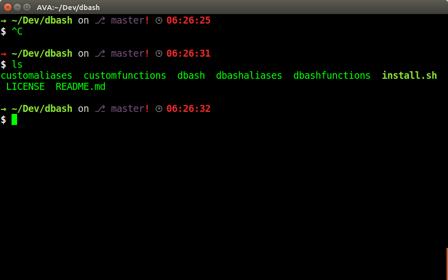

# DBash - Bash customization

Files with customized colors and format to bash.

## Install

Just type `source install.sh`

The script will make:

1. Put the next files in your **home** folder:
* customaliases -> .customaliases
* customfunctions -> .customfunctions
* dbash -> .dbash
* dbashaliases -> .dbashaliases
* dbashfunctions -> .dbashfunctions

2. Add the next line at the end of **/home/user/.bashrc** file:

```
source ~/.dbash
```

## Customize

1. Add your aliases at **.customaliases** file
2. Add your functions at **.customfunctions** file

## Screenshots


